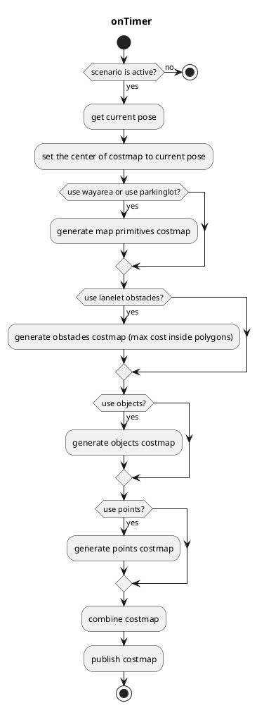

# costmap_generator

## costmap_generator_node

This node reads `PointCloud` and/or `DynamicObjectArray` and creates an `OccupancyGrid` and `GridMap`. `VectorMap(Lanelet2)` is optional.

### Input topics

| Name                      | Type                                       | Description                                                                  |
| ------------------------- | ------------------------------------------ | ---------------------------------------------------------------------------- |
| `~input/objects`          | autoware_perception_msgs::PredictedObjects | predicted objects, for obstacles areas                                       |
| `~input/points_no_ground` | sensor_msgs::PointCloud2                   | ground-removed points, for obstacle areas which can't be detected as objects |
| `~input/vector_map`       | autoware_map_msgs::msg::LaneletMapBin      | vector map, for drivable areas                                               |
| `~input/scenario`         | tier4_planning_msgs::Scenario              | scenarios to be activated, for node activation                               |

### Output topics

| Name                     | Type                    | Description                                        |
| ------------------------ | ----------------------- | -------------------------------------------------- |
| `~output/grid_map`       | grid_map_msgs::GridMap  | costmap as GridMap, values are from 0.0 to 1.0     |
| `~output/occupancy_grid` | nav_msgs::OccupancyGrid | costmap as OccupancyGrid, values are from 0 to 100 |

### Output TFs

None

### How to launch

1. Execute the command `source install/setup.bash` to setup the environment

2. Run `ros2 launch costmap_generator costmap_generator.launch.xml` to launch the node

### Parameters

| Name                         | Type     | Description                                                                                    |
| ---------------------------- | ------   | ---------------------------------------------------------------------------------------------- |
| `update_rate`                | double   | timer's update rate                                                                            |
| `activate_by_scenario`       | bool     | if true, activate by scenario = parking. Otherwise, activate if vehicle is inside parking lot. |
| `use_objects`                | bool     | whether using `~input/objects` or not                                                          |
| `use_points`                 | bool     | whether using `~input/points_no_ground` or not                                                 |
| `use_wayarea`                | bool     | whether using `wayarea` from `~input/vector_map` or not                                        |
| `use_parkinglot`             | bool     | whether using `parkinglot` from `~input/vector_map` or not                                     |
| `use_lanelet_obstacles`      | bool     | whether marking `obstacle`-type polygons from `~input/vector_map` with maximum cost or not     |
| `costmap_frame`              | string   | created costmap's coordinate                                                                   |
| `vehicle_frame`              | string   | vehicle's coordinate                                                                           |
| `map_frame`                  | string   | map's coordinate                                                                               |
| `grid_min_value`             | double   | minimum cost for gridmap                                                                       |
| `grid_max_value`             | double   | maximum cost for gridmap                                                                       |
| `grid_resolution`            | double   | resolution for gridmap                                                                         |
| `grid_length_x`              | int      | size of gridmap for x direction                                                                |
| `grid_length_y`              | int      | size of gridmap for y direction                                                                |
| `grid_position_x`            | int      | offset from coordinate in x direction                                                          |
| `grid_position_y`            | int      | offset from coordinate in y direction                                                          |
| `maximum_lidar_height_thres` | double   | maximum height threshold for pointcloud data (relative to the vehicle_frame)                   |
| `minimum_lidar_height_thres` | double   | minimum height threshold for pointcloud data (relative to the vehicle_frame)                   |
| `expand_rectangle_size`      | double   | expand object's rectangle with this value                                                      |
| `size_of_expansion_kernel`   | int      | kernel size for blurring effect on object's costmap                                            |
| `objects_cost_mode`          | string   | cost source for object costmap cells                                                           |
| `fixed_objects_cost`         | double   | fixed cost value used when `objects_cost_mode` is `"fixed"`                                    |
| `excluded_object_labels`     | string[] | list of object classification labels to exclude from the costmap                               |

### Object Label Filtering

The `excluded_object_labels` parameter controls which `PredictedObject` classification types are **excluded** from the costmap built by `makeCostmapFromObjects`. For each object the dominant label (highest classification probability) is determined; if it appears in the exclusion list the object is skipped entirely.

**Supported label values:**

`unknown`, `car`, `truck`, `bus`, `trailer`, `motorcycle`, `bicycle`, `pedestrian`

**Default configuration** (in `costmap_generator.param.yaml`):

```yaml
excluded_object_labels:
  - "unknown"
```

This filters out `UNKNOWN` objects whose bounding areas tend to be larger than the actual obstacle. To compensate for the removed detections the node can additionally consume a `PointCloud` input (e.g. from clustering) which provides obstacle coverage without the over-sized shapes.

An empty list disables filtering — all objects pass through (backward-compatible behaviour).

Unrecognised label strings are mapped to `UNKNOWN` and a warning is logged once at node start-up.

### Flowchart



### Costmap Diff Heatmap Overlay

The `CostmapDiffOverlay` component tracks cells that changed between consecutive `OccupancyGrid` frames and publishes a heatmap overlay to `~/overlayed_costmap`. This makes dynamic obstacles, sensor noise, and transient costmap changes visually apparent during parking maneuvers.

#### How it works

1. On every costmap cycle, `onCostmap()` compares the current costmap against the previous one.
2. For each cell where $\Delta = |cost_{current} - cost_{previous}| > 0$, the cell is marked as changed and highlighted for `costmap_diff_window_sec` seconds.
3. The heat intensity uses a logarithmic mapping:

$$heat = \text{round}\left(heat_{min} + heat_{span} \cdot \frac{\ln(1 + \Delta)}{\ln(101)}\right)$$

4. Cells that change repeatedly receive a frequency boost (+10) for higher visibility.
5. Only free-space cells appear in the heatmap; occupied cells (cost > 0) are skipped.
6. When the costmap origin shifts (vehicle motion), persistent highlight state is remapped to the new grid frame so highlights survive origin changes.

#### Additional output topic

| Name                  | Type                    | Description                                         |
| --------------------- | ----------------------- | --------------------------------------------------- |
| `~/overlayed_costmap` | nav_msgs::OccupancyGrid | heatmap of recently changed cells (transient local) |

#### Additional parameter

| Name                      | Type | Default | Description                                            |
| ------------------------- | ---- | ------- | ------------------------------------------------------ |
| `costmap_diff_window_sec` | int  | 30      | time window (seconds) a changed cell stays highlighted |
